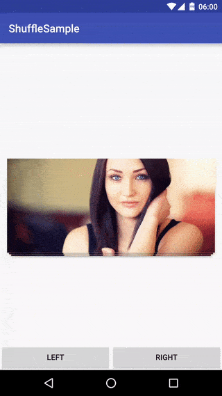
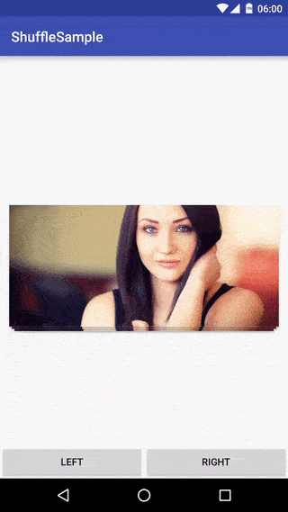

Shuffle
=======

[][repo]
[](https://travis-ci.org/Meetic/Shuffle)

An easy to use swiping-view for Android

[][repo]

# Usage

Just declare a Shuffle into your layout

```xml
<com.meetic.shuffle.Shuffle
      android:id="@+id/shuffle"
      android:layout_width="match_parent"
      android:layout_height="200dp"
      />
```

Then fill it with an Adapter
```java
Shuffle shuffle = (Shuffle)findViewById(R.id.shuffle);
shuffle.setShuffleAdapter(new Shuffle.Adapter(){
    @Override
    public Shuffle.ViewHolder onCreateViewHolder(ViewGroup viewGroup, int type) {

    }

    @Override
    public void onBindViewHolder(final Shuffle.ViewHolder viewHolder, int position) {

    }

    @Override
    public int getItemCount() {

    }
});
```

# Customisation
## Movements

### Free movements
[][repo]

```xml
<com.meetic.shuffle.Shuffle
      android:id="@+id/shuffle"
      android:layout_width="match_parent"
      android:layout_height="200dp"
      app:shuffle_inlineMove="false"
      />
```

### Inline movements
[][repo]

```xml
<com.meetic.shuffle.Shuffle
      android:id="@+id/shuffle"
      android:layout_width="match_parent"
      android:layout_height="200dp"
      app:shuffle_inlineMove="true"
      />
```

## Orientation

If you want to set it vertical (by default Suffle is horizontal oriented)
```xml
<com.meetic.shuffle.Shuffle
     android:id="@+id/shuffle"
     android:layout_width="match_parent"
     android:layout_height="200dp"
     app:shuffle_orientation="horizontal / vertical"
     />
```

[][repo]

## Rotation

Without rotation
```xml
<com.meetic.shuffle.Shuffle
     android:id="@+id/shuffle"
     android:layout_width="match_parent"
     android:layout_height="200dp"
     app:shuffle_rotationEnabled="false"
     />
```

[][repo]

With rotation

```xml
<com.meetic.shuffle.Shuffle
     android:id="@+id/shuffle"
     android:layout_width="match_parent"
     android:layout_height="200dp"
     app:shuffle_rotationEnabled="false"
     app:shuffle_rotation="10"
     />
```

[][repo]

## Restart

To restart the shuffling
```java
shuffle.restartShuffling();
```

[][repo]

## Options

You can set the max number of cards displayed and adjust the space between cards

```xml
<com.meetic.shuffle.Shuffle
     android:id="@+id/shuffle"
     android:layout_width="match_parent"
     android:layout_height="200dp"
     app:shuffle_numberOfDisplayedCards="4"
     app:shuffle_differenceTranslationY="5dp"
     app:shuffle_differenceTranslationX="1dp"
     />
```

[][repo]

# Listeners

```java
shuffle.addListener(new Shuffle.Listener() {
            @Override
            public void onViewChanged(int position) {

            }

            @Override
            public void onScrollStarted() {

            }

            @Override
            public void onScrollFinished() {

            }

            @Override
            public void onViewExited(DraggableView draggableView, Direction direction) {

            }

            @Override
            public void onViewScrolled(DraggableView draggableView, float percentX, float percent) {

            }
        });
```

# CardDraggableView

```xml
<Shuffle
    ...
    //overlay color displayed while scrolling
    app:shuffle_colorRight="@color/blue"
    app:shuffle_colorLeft="@color/blue"

    //overlay content displayed while scrolling (ex: containing logo)
    app:shuffle_layoutLeft="@layout/bal_shuffle_cell_left"
    app:shuffle_layoutRight="@layout/bal_shuffle_cell_right"
    ...
    />
```

[][repo]

# Animations

All Shuffle animations can be overriden
```java
shuffle.setViewAnimator(new ShuffleViewAnimator(){
            //override methods
});
```

Try `ShuffleViewAnimator` and `ShuffleViewAnimatorOnSecondCard

# Enable

```java
shuffle.enable(true / false);
```

# Download

Add into your **build.gradle**

[  ](https://bintray.com/meetic-android/maven/Shuffle/_latestVersion)

```groovy
compile 'com.meetic.shuffle:shuffle:(last version)'
compile 'com.meetic.dragueur:dragueur:1.0.1'
```

Move your views with [Dragueur][Dragueur] !

# Credits

A project initiated by Meetic

This project was first developed by Meetic and has been open-sourced since. We will continue working on it.
We encourage the community to contribute to the project by opening tickets and/or pull requests.

[][meetic]

Contributor: [Florent Champigny][florent]   

#License

    Copyright 2016 Meetic, Inc.

    Licensed under the Apache License, Version 2.0 (the "License");
    you may not use this file except in compliance with the License.
    You may obtain a copy of the License at

       http://www.apache.org/licenses/LICENSE-2.0

    Unless required by applicable law or agreed to in writing, software
    distributed under the License is distributed on an "AS IS" BASIS,
    WITHOUT WARRANTIES OR CONDITIONS OF ANY KIND, either express or implied.
    See the License for the specific language governing permissions and
    limitations under the License.

[repo]: https://github.com/Meetic/Shuffle
[androidarsenal]: http://android-arsenal.com/details/--------
[meetic]: http://www.meetic.fr/
[dragueur]: https://github.com/Meetic/Dragueur
[florent]: https://github.com/florent37
